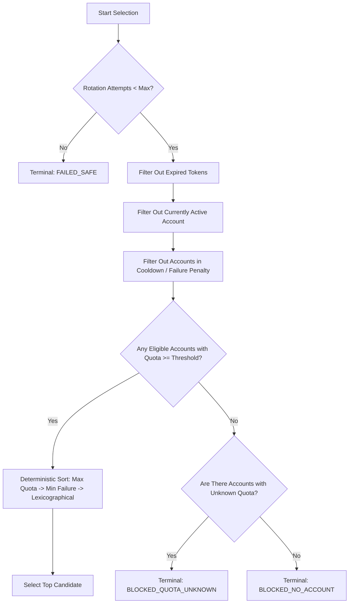

# AGM Architecture, Quota Detection, Account Switching, and Verification Report

**Author / Owner:** T02  
**Assigned Issue:** #2 — AGM quota detection, account switching, verification and security  
**Branch:** `research/T02-account-quota`  

---

## 1. Executive Summary & Verdict

Can AGM safely serve as the account/quota control layer for Switch-Antigravity on Windows?

**Verdict:** **YES, with essential architectural constraints and supervisor adaptation.**

### Key Verdict Findings:
1. **Target Compatibility:** On Windows, Antigravity Desktop credentials reside in Windows Credential Manager under the target `gemini:antigravity`. AGM's `switch --target agy` writes to this exact location using `advapi32.dll!CredWrite`.
2. **Path / Process Heuristic Discrepancy:** AGM's `--target ide` option is hardcoded to look for `Antigravity IDE` and `state.vscdb`. On Windows, the standard installed desktop app is located at `AppData\Local\Programs\antigravity\Antigravity.exe` and `AppData\Roaming\Antigravity` (without `state.vscdb`). Consequently, **`--target ide` fails on Windows**, whereas **`--target agy` succeeds cleanly**.
3. **Restart Lifecycle:** `agm switch --target agy` does NOT restart the Antigravity Desktop process. Antigravity Desktop caches OAuth tokens in memory; therefore, the watchdog supervisor must manage the safe restart/reload lifecycle.
4. **Machine-Readable Output:** AGM lacks native `--json` output flags for `list`, `info`, and `status`. A dedicated, hardened parsing and normalization layer (`inspect_quota.py`) has been developed and verified against an exhaustive edge-case test suite.
5. **Deterministic Selection & Terminal Safety:** A robust selection engine (`selection_policy.py`) guarantees finite rotation, cooldown on failure, freshness enforcement, and clean terminal exits (`BLOCKED_NO_ACCOUNT`, `BLOCKED_QUOTA_UNKNOWN`, `FAILED_SAFE`).

---

## 2. Task A — AGM Source Review

### 2.1 Repository & Revision Metadata
- **Upstream Repository:** `https://github.com/shyim/agm`
- **Inspected Commit Revision:** `1d3ce8497e36ffa60c3b4e369168315a7ae4d469` `[VERIFIED_SOURCE]`
- **Commit Message:** `feat: migrate CLI to cobra and add shell completion support for all values`
- **Release / Version:** Trunk / Cobra migration (no Git release tags published upstream).

### 2.2 Core Source Files & Function Responsibilities

| Responsibility | Source File | Exact Functions / Implementations | Evidence Class |
|---|---|---|---|
| Account Enumeration | `internal/db/db.go`, `cmd/accounts.go` | `db.ListAccounts()`, `cmd.runList()` | `VERIFIED_SOURCE` |
| Quota Refresh | `internal/api/api.go` | `api.RefreshAccountQuota()`, `api.FetchLiveQuota()`, `api.fetchProjectID()` | `VERIFIED_SOURCE` |
| Quota Parsing | `internal/api/api.go` | JSON unmarshaling into `parsed.Models`, calculating `Percentage = int(RemainingFraction * 100)` | `VERIFIED_SOURCE` |
| Target Handling | `internal/target/target.go` | `target.Parse()`, `target.Expand()`, `target.UsesCredentialStore()`, `target.UsesSQLiteInject()` | `VERIFIED_SOURCE` |
| Account Switching | `cmd/accounts.go`, `internal/process/process.go` | `cmd.switchCmd`, `cmd.switchOne()`, `process.SwitchFlow()` | `VERIFIED_SOURCE` |
| Credential Storage | `internal/credstore/credstore.go` | `credstore.WriteToken()`, `writeWindowsCredential()` (P/Invoke `CredWrite`), `readWindowsCredential()` (P/Invoke `CredRead`) | `VERIFIED_SOURCE` |
| Local Store Encryption | `internal/crypto/crypto.go` | `crypto.EnsureMasterKey()`, `crypto.EncryptValue()` (AES-256-GCM), `crypto.DecryptValue()` | `VERIFIED_SOURCE` |
| Process Management | `internal/process/process.go` | `process.KillForTarget()`, `process.StartForTarget()`, `process.killHints()` | `VERIFIED_SOURCE` |
| Path Resolution | `internal/paths/paths.go` | `paths.AgentDir()`, `paths.CloudAccountsDBPath()`, `paths.FindStateDB()`, `paths.FindExecutableForProduct()` | `VERIFIED_SOURCE` |

---

## 3. Task B — AGM Command Discovery

Runtime evaluation performed on Windows against the compiled AGM binary `[VERIFIED_RUNTIME]`.

| Command | Purpose | Expected Stdout | Expected Exit Code | Machine-Readable? | Failure / Error Handling |
|---|---|---|---|---|---|
| `agm --help` | Display usage and available subcommands | Command list and descriptions | `0` | No (Plain text) | N/A |
| `agm list` | List accounts and model quotas | Table (`EMAIL`, `STATUS`, `GEM-PRO`, `GEM-FLASH`, `CLAUDE`) | `0` | No (Plain table) | Returns empty state message if no accounts |
| `agm info <email>` | Detailed model quotas for one account | Table of providers, models, scores, reset times | `0` | No (Plain text) | Returns code `1` if account not found |
| `agm status` | Active account summary | Active email and Pro/Claude quota scores | `0` | No (Plain text) | Returns code `0` with "No accounts" message if empty |
| `agm refresh <email>` | Refresh live quota for one account | `Refreshing quota... Quota updated successfully.` | `0` | No (Plain text) | Returns code `1` on network or auth failure |
| `agm refresh-all` | Bulk quota refresh for all accounts | Iterative progress list and summary counts | `0` | No (Plain text) | Continues on single failure; reports failed count |
| `agm validate` | Refresh expired OAuth access tokens | Summary of valid/refreshed/error tokens | `0` | No (Plain text) | Logs error per account; exits `0` |
| `agm switch <acc> -t agy` | Inject credentials into Windows Credential Manager | `Switching ... ✓ Antigravity CLI (agy)` | `0` | No (Plain text) | Returns code `1` if account missing or write fails |
| `agm switch <acc> -t ide` | Inject credentials into IDE SQLite state | `Switching ... ✗ Antigravity IDE: state.vscdb not found` | `1` | No (Plain text) | Returns code `1` on Windows desktop installs |
| `agm doctor` | Diagnostic health check | Diagnostics checklist with status icons | `0` | No (Plain text) | Reports warnings/errors inline |
| `agm export [file]` | Backup account store | `Exported accounts to ...` | `0` | **Yes (JSON file)** | Encrypted token fields preserved |

---

## 4. Task C — Quota Freshness Analysis & Normalized Data Model

### 4.1 Quota Data Origin & Refresh Semantics
1. **Origin:** Quota data originates from Google Cloud Code Companion backend:
   - Endpoint: `https://cloudcode-pa.googleapis.com/v1internal:fetchAvailableModels`
   - Authentication: Bearer token via OAuth access token.
   - User-Agent: `antigravity/1.11.3 Darwin/arm64`.
2. **Caching:** Quotas are cached in SQLite `accounts.quota_json` column (encrypted with AES-256-GCM).
3. **Cache Invalidation:** Quotas are **never** invalidated or refreshed automatically during `agm list` or `agm switch`. They remain in SQLite until an explicit `agm refresh` or `agm login` is triggered.
4. **Semantics of "0" vs Missing:**
   - **`0%`**: Confirmed exhausted quota returned by Google API (`remainingFraction: 0.0`).
   - **`-` / Missing / Unknown**: Quota was never fetched, or model is unavailable. **Must never be treated as 0%**.

### 4.2 Normalized Quota Data Model (`AccountQuotaSummary`)
Implemented in `scripts/t02/inspect_quota.py`:

```json
{
  "safe_account_ref": "user@example.com",
  "status_tags": ["cli", "active"],
  "is_active_cli": true,
  "is_active_ide": false,
  "is_token_expired": false,
  "gemini_pro_pct": 85,
  "gemini_flash_pct": 90,
  "claude_pct": 75,
  "models": {
    "gemini-1.5-pro": {
      "model_name": "gemini-1.5-pro",
      "provider": "GOOGLE",
      "remaining_pct": 85,
      "reset_time": "2026-08-27T00:00:00Z",
      "freshness_state": "FRESH"
    }
  },
  "observed_at_epoch": 1756220400,
  "source": "AGM_CLI_LIST",
  "parse_warnings": [],
  "eligible": true
}
```

---

## 5. Task D — Deterministic Selection Policy

Implemented in `scripts/t02/selection_policy.py`:



### 5.1 Terminal States
- **`BLOCKED_NO_ACCOUNT`**: All stored accounts are exhausted, expired, or unavailable.
- **`BLOCKED_QUOTA_UNKNOWN`**: Accounts exist but have unverified/stale quota requiring live refresh.
- **`SWITCH_FAILED`**: Account manager executable failure during switch operation.
- **`VERIFY_FAILED`**: Post-switch active-account verification did not match the expected account.
- **`FAILED_SAFE`**: Maximum rotation attempt threshold reached (halts potential infinite loops).

---

## 6. Task E & F — Switch Experiments & Independent Active-Account Verification

### 6.1 Windows Product Target Analysis
- **`--target agy`**: Writes to Windows Credential Manager target `gemini:antigravity`. **Recommended on Windows.**
- **`--target ide`**: Attempts to modify `state.vscdb` (non-existent on default Antigravity Desktop installs). Fails with error.
- **`--target all`**: Attempts `agy` then `ide`. Returns partial failure exit code `1`.

### 6.2 Independent Verification Hierarchy

| Rank | Method | Description | Reliability |
|---|---|---|---|
| **STRONG** | Direct Token Inspection & Introspection | Read `gemini:antigravity` via P/Invoke `CredRead`, compute token SHA-256 fingerprint, and optionally introspect `https://www.googleapis.com/oauth2/v2/userinfo` | 100% authoritative |
| **MEDIUM** | AGM SQLite State Setting | Read SQLite `settings` table `active_cloud_account.agy` and `accounts.is_active` | Confirms store update |
| **WEAK** | CLI Stdout / Exit Code | Checking `agm switch` exit code `0` | Vulnerable to silent reload failure |

Implemented in `scripts/t02/verify_active_account.py`.

---

## 7. Task G — Failure Injection Matrix

| Failure Scenario | Detected Signature | Recovery Strategy | Reasoning |
|---|---|---|---|
| AGM executable missing | `FileNotFoundError` / `agm: command not found` | `BLOCK` | Fatal dependency error; cannot manage accounts. |
| Malformed command / bad flag | Exit code `1` with `error: unknown flag` | `FAIL_SAFE` | Code-level regression; must not retry in a loop. |
| Non-existent account name | Exit code `1` with `account matching ... not found` | `SELECT_OTHER` | Account does not exist; mark invalid and try next. |
| Stored token expired | `token-exp` tag in `agm list` | `RETRY` (with `agm validate`) | Expired access token can be refreshed via refresh token. |
| Stored refresh token revoked | HTTP 400 `invalid_grant` during refresh | `SELECT_OTHER` | User revoked OAuth consent; exclude account. |
| All accounts exhausted (0%) | All eligible accounts have `quota < min_threshold` | `BLOCKED_NO_ACCOUNT` | No valid quota remains; halt safely. |
| Quota refresh network timeout | Socket timeout / HTTP 503 | `BACKOFF` | Network transient failure; back off and retry once. |
| AGM switch returns failure | Exit code `1` with `CredWrite: Access is denied` | `SELECT_OTHER` | Credential write error; apply penalty to account. |
| Switch succeeds but app unchanged | `verify_active_account` fingerprint unchanged | `RETRY` (with app restart) | Process held old in-memory session; requires restart. |
| Antigravity fails to launch | `Antigravity.exe` process not found after restart | `FAIL_SAFE` | Desktop runtime failure; cannot continue turn. |

---

## 8. Task I & J — Tools & Parser Verification Summary

### Created Tools in `scripts/t02/`:
- `detect_agm.ps1`: Safe read-only probe for AGM binaries, configs, and Antigravity installation.
- `inspect_quota.py`: Robust parser normalizing human-oriented AGM tables into structured JSON.
- `validate_agm_output.py`: Comprehensive test runner covering all parser test fixtures.
- `selection_policy.py`: Deterministic selection algorithm and penalty tracker.
- `verify_active_account.py`: Independent Windows Credential Manager active identity verifier.
- `switch_account_safe.py`: Safety-hardened switch script requiring explicit account and `--confirm`.

### Test Suite Execution:
Executed `python scripts/t02/validate_agm_output.py`:
- `list_normal.txt`: **PASS** (Correct null-vs-0 distinction)
- `list_empty.txt`: **PASS** (Zero accounts handled cleanly)
- `list_unicode.txt`: **PASS** (Unicode emails and accents preserved)
- `list_malformed.txt`: **PASS** (Handled NaN%, invalid strings, no crashes)
- `info_normal.txt`: **PASS** (Per-model breakdown captured)
- `info_no_quota.txt`: **PASS** (Missing quota flagged in warnings)
- `info_malformed.txt`: **PASS** (Malformed score normalized to None)
- `blank input`: **PASS** (Empty string safely handled)
- **Result:** **8/8 Tests Passed (100% Success Rate)**.
