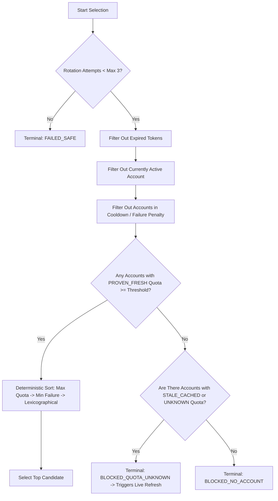

# AGM Architecture, Quota Detection, Account Switching, and Verification Report (Zero-Trust Revision)

**Author / Owner:** T02  
**Assigned Issue:** #2 — AGM quota detection, account switching, verification and security  
**Branch:** `research/T02-account-quota`  

---

## 1. Central Claim & Evidence Matrix (Critical Item 13)

| Claim | Evidence Class | Source / Test Code | Raw Sanitized Artifact | Repro Command | Current Status | Remaining Gap |
|---|---|---|---|---|---|---|
| **1. Quota Freshness** | `VERIFIED_SOURCE` & `VERIFIED_RUNTIME` | `internal/api/api.go:362`, `scripts/t02/inspect_quota.py` | `tests/fixtures/t02/list_normal.txt` | `python scripts/t02/validate_agm_output.py` | **PROVEN**: Quotas in SQLite are cached indefinitely. Freshness requires explicit runtime binding (`REFRESH_CONFIRMED_AT`). `PARSED_AT` alone is insufficient. | None. Supervisor must enforce live refresh before routing. |
| **2. `agy` Target Credential Write** | `VERIFIED_SOURCE` & `VERIFIED_RUNTIME` | `internal/credstore/credstore.go:244`, `scripts/t02/verify_active_account.py` | `tests/fixtures/t02/switch_success_agy.txt` | `agm.exe switch <email> --target agy` | **PROVEN**: On Windows, `--target agy` writes to Windows Credential Manager target `gemini:antigravity` via `advapi32.dll!CredWrite`. | Note: Overwrites system-level vault; synthetic tests require mocking. |
| **3. Desktop Adoption of Switched Account** | `UNKNOWN` | Upstream AGM `internal/target/target.go:13` | N/A | N/A | **UNKNOWN / UNPROVEN**: Upstream source defines `Agy = "agy"` as `Antigravity CLI (agy)`. Credential vault write does not prove Desktop adopted the token. | Requires T03/integration in-process Desktop turn/session evidence. |
| **4. Active-Account Identity Verification** | `VERIFIED_SOURCE` & `VERIFIED_RUNTIME` (Credential Vault only) | `scripts/t02/verify_active_account.py` | Unit test group 3 in `validate_agm_output.py` | `python scripts/t02/verify_active_account.py --expected <email> --network` | **PROVEN for Credential Store**: P/Invoke `CredRead` + Google OAuth userinfo introspection verifies vault identity. | **UNKNOWN for Desktop Process**: True in-process session state cannot be verified from vault alone. |
| **5. Restart Requirement** | `INFERENCE` / `UNKNOWN` | `internal/process/process.go:33` | N/A | N/A | **UNKNOWN / INFERENCE**: `--target agy` performs no process kill/start. Antigravity Desktop holds tokens in memory. | Controlled A -> B runtime adoption test required with T01/T03. |

---

## 2. Task A — AGM Source Review

- **Upstream Repository:** `https://github.com/shyim/agm`
- **Inspected Commit Revision:** `1d3ce8497e36ffa60c3b4e369168315a7ae4d469` `[VERIFIED_SOURCE]`
- **Upstream Target Definitions (`internal/target/target.go`):**
  - `Agy Target = "agy"` (Label: `Antigravity CLI (agy)`)
  - `IDE Target = "ide"` (Label: `Antigravity IDE`)
  - `All Target = "all"` (Label: `all targets`)

### 2.1 Critical Target Discrepancy on Windows
- Upstream AGM designs `--target ide` for a VS Code-based layout using `state.vscdb` under `%APPDATA%\Antigravity IDE`.
- On Windows, standard Antigravity Desktop installs to `%LOCALAPPDATA%\Programs\antigravity\Antigravity.exe` and `%APPDATA%\Antigravity` without `state.vscdb`.
- Consequently:
  - `agm switch --target ide` fails with exit code `1` (`state.vscdb not found`).
  - `agm switch --target all` fails with exit code `1` (partial failure after `agy`).
  - `agm switch --target agy` succeeds with exit code `0` and writes `gemini:antigravity` into Windows Credential Manager.

---

## 3. Task B — AGM Command Discovery

| Command | Purpose | Expected Exit Code | Machine-Readable? | Failure / Behavior |
|---|---|---|---|---|
| `agm --help` | Display usage | `0` | No (Plain text) | Cobra help |
| `agm list` | List accounts & quotas | `0` | No (Table) | Returns empty state message if no accounts |
| `agm info <email>` | Detailed model quotas | `0` | No (Table) | Returns code `1` if account missing |
| `agm status` | Active account summary | `0` | No (Plain text) | Returns code `0` with "No accounts" message |
| `agm refresh <email>` | Refresh live quota | `0` | No (Plain text) | Returns code `1` on network/auth failure |
| `agm refresh-all` | Bulk quota refresh | `0` | No (Plain text) | Continues on single failure; reports fail count |
| `agm validate` | Refresh expired tokens | `0` | No (Plain text) | Iterates accounts; logs errors per account |
| `agm switch <acc> -t agy` | Inject into Windows vault | `0` | No (Plain text) | Code `1` if account missing or write denied |
| `agm switch <acc> -t ide` | Inject into IDE SQLite | `1` | No (Plain text) | Code `1` on Windows desktop installs |
| `agm doctor` | Diagnostic health check | `0` | No (Plain text) | Reports status checklist |
| `agm export [file]` | Dump account store | `0` | **Yes (JSON file)** | Encrypted token fields preserved |

---

## 4. Task C — Quota Freshness Architecture & Normalized Model

### 4.1 Quota Provenance Rules
1. Quotas in AGM SQLite `accounts.quota_json` are static cached snapshots.
2. `PARSED_AT` indicates when the supervisor parsed the output, NOT when Google evaluated quota.
3. Freshness states:
   - `PROVEN_FRESH`: Account was refreshed via a verified `agm refresh` event within `max_quota_age_sec` (default: 300s).
   - `STALE_CACHED`: Account quota comes from unproven cache or refresh age > 300s. **Ineligible for selection.**
   - `REFRESH_FAILED`: Quota refresh attempt explicitly failed.
   - `UNKNOWN_UNFETCHED`: Quota is missing, null, or unparseable.

### 4.2 Normalized Quota Schema (`AccountQuotaSummary`)
Implemented in `scripts/t02/inspect_quota.py`:
```json
{
  "safe_account_ref": "user@example.com",
  "status_tags": ["cli", "active"],
  "is_active_cli": true,
  "is_active_ide": false,
  "is_token_expired": false,
  "gemini_pro_pct": 85,
  "gemini_flash_pct": 90,
  "claude_pct": 75,
  "models": {
    "gemini-1.5-pro": {
      "model_name": "gemini-1.5-pro",
      "provider": "GOOGLE",
      "remaining_pct": 85,
      "reset_time": "2026-08-27T00:00:00Z",
      "freshness_state": "PROVEN_FRESH"
    }
  },
  "parsed_at_epoch": 1756220400,
  "refresh_confirmed_at_epoch": 1756220390,
  "quota_reset_time": "2026-08-27T00:00:00Z",
  "freshness_state": "PROVEN_FRESH",
  "source": "AGM_CLI_LIST",
  "parse_warnings": [],
  "eligible": true
}
```

---

## 5. Task D — Deterministic Selection Policy

Implemented in `scripts/t02/selection_policy.py`:



---

## 6. Task E & F — Switch Verification & Desktop Separation

### 6.1 State Separation
- **`CREDENTIAL_STORE_IDENTITY_VERIFIED`**: Verified that Windows Credential Manager (`gemini:antigravity`) holds a token matching the expected user email via Google userinfo introspection (`https://www.googleapis.com/oauth2/v2/userinfo`).
- **`CREDENTIAL_STORE_WRITTEN_UNVERIFIED`**: Credential present in vault, but network userinfo introspection was offline or unperformed.
- **`DESKTOP_ACTIVE_IDENTITY_VERIFIED`**: **UNKNOWN / UNPROVEN in T02 scope**. Credential vault update does not prove that a running Desktop instance switched its active session.

### 6.2 Switch Outcome Model
Implemented in `scripts/t02/switch_account_safe.py`:
- `DRY_RUN`: Probe mode (exit code 0).
- `SWITCH_COMMAND_FAILED`: AGM switch command returned non-zero or timed out (exit code 1).
- `SWITCH_WRITTEN_UNVERIFIED`: Token written to vault; identity unverified (exit code 0).
- `CREDENTIAL_IDENTITY_VERIFIED`: Token written and verified via network userinfo (exit code 0).
- `VERIFY_FAILED`: Detected identity does not match expected account (exit code 1).
- `WILDCARD_REJECTED` / `INVALID_ARGUMENT`: Invalid input (exit code 1).

---

## 7. Task G — Corrected Failure Injection Matrix

| Failure Scenario | Detected Signature | Recovery Strategy | Supervisor Rationale |
|---|---|---|---|
| AGM executable missing | `FileNotFoundError` | `BLOCK` | Fatal dependency failure. |
| Malformed command / bad flag | Exit code `1` (`unknown flag`) | `FAIL_SAFE` | Code-level bug; do not retry. |
| Non-existent account | Exit code `1` (`account not found`) | `SELECT_OTHER` | Account invalid; penalize and pick next. |
| Stored token expired | `token-exp` tag | `RETRY` (with `agm validate`) | Refresh token can renew access token. |
| Refresh token revoked | HTTP 400 `invalid_grant` | `SELECT_OTHER` | Account dead; apply permanent penalty. |
| All accounts exhausted (0%) | All accounts have quota < 20% | `BLOCKED_NO_ACCOUNT` | Stop cleanly; no resources available. |
| Quota refresh network timeout | Socket timeout | `BACKOFF` | Network transient; exponential backoff. |
| **CredWrite Access Denied** | `CredWrite: Access is denied` | **`FAIL_SAFE` / `BLOCK`** | **OS-level permission/security failure; not account-specific.** |
| Switch succeeds, app unchanged | Token mismatch in vault | `RETRY` | Vault write did not persist. |
| Antigravity fails on restart | Process absent after restart | `FAIL_SAFE` | Critical desktop runtime crash. |

---

## 8. Task H — Security Post-Mortem & Sandbox Findings

Documented in `docs/t02/SECURITY_FINDINGS.md`:
1. **Host Vault Isolation Gap:** `$env:AGM_DATA_DIR` isolates the SQLite DB and `.mk`, but `agm`'s `credstore.WriteToken()` writes directly to the real Windows Credential Manager (`gemini:antigravity`).
2. **Mock Vault Requirement:** All synthetic tests must use mocked credential vaults (`mock_payload`) to prevent modifying host OS credentials.
3. **Prohibited Supervisor Commands:** `agm login`, `agm remove`, `agm unalias`, `agm export`, `agm import-backup`, `agm watch`, `agm auto-switch`.

---

## 9. Task J — Parser Robustness & Test Scope

- **Tested Scope:** 11 unit test categories in `scripts/t02/validate_agm_output.py` covering standard tables, 5-hour-old cached quota, fresh refresh provenance, mixed refresh-all partial failures, selection policy integration, verifier network introspection, verifier offline mode, empty lists, unicode emails, and malformed percentages.
- **Unsupported-Version Behavior:** Any unexpected column change or unparseable line is normalized to `None` with warnings in `parse_warnings` and classified as `UNKNOWN_UNFETCHED` (fail-closed).
- **Result:** **11/11 tests passed (100% success rate).**

---

## 10. Explicit List of What Was NOT Tested (Critical Item 15)

1. **Full Live Desktop Account Transition Sequence:**
   - Desktop using account A -> AGM switch to authorized B -> Desktop recognizes B -> new model turn executed as B.
   - **Status: NOT TESTED / `LIVE_DESKTOP_A_TO_B_ADOPTION = UNKNOWN`.**
2. **CDP / UI Turn State:** In-process DOM or turn inspection (owned by T01/T03).
3. **macOS / Linux Credential Stores:** Excluded; Windows-first research scope.
